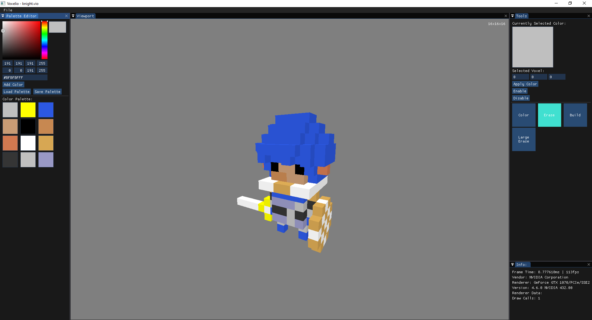
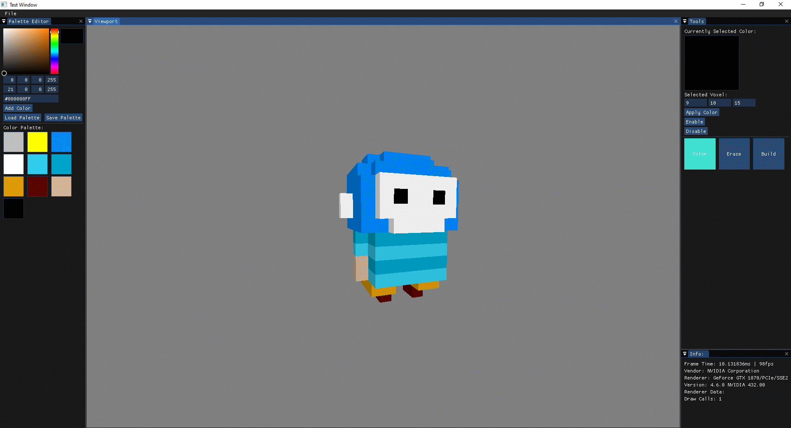
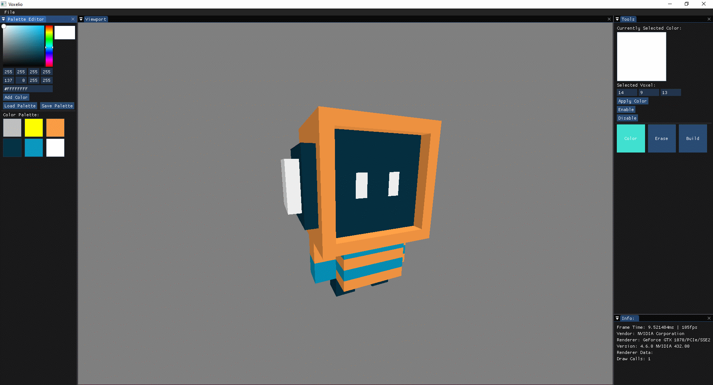

# Voxelio

Voxelio is an Open Source WIP Voxel Editor. It allows you to create 3D graphics made up of cubes. 

Created by Cian Jinks (contact via cjinks99@gmail.com)

**Supported Platforms:**

* Windows

(I have yet to test compiling and running on both Linux and MacOS and would really appreciate of someone would be able to do so)

## Download

The latest release of Voxelio can be obtained via the [releases page](https://github.com/cianjinks/Voxelio/releases).

If you encounter any problems while running on one of the supported platforms mentioned above please [open an issue](https://github.com/cianjinks/Voxelio/issues).

## Preview

Credits in [video](https://youtu.be/HtH4kQmGAtI) description

Based on [this artwork](https://www.pinterest.ie/pin/486177722254960160)

Based on [this artwork](https://www.youtube.com/williamsantacruzvoxelart)

If you end up creating something using Voxelio please share it with me by email to cjinks99@gmail.com. I would love to see what you create and possibly feature it here!

## Tutorial

## Features

**Current:**

*   Palette with up to 4096 colors
*   32 bit colors
*   Sparse Voxel Octree Datastructure
*   Raytraced Rendering
*   Saving and Loading of Projects
*   Up to 256³ scene size (for now) 

**Planned:**

*   Screenshot capturing and rendering
*   Helper display grid
*   Perspective switching
*   Many more tools (fill blocks, fill color, selection, erase selection, etc)
*   Rendered scene view
*   Placeable lighting (merge SVO with normal rasterization)

## Building from Source

Before building you will first have to clone this project. However, it contains some submodules so please use:

    git clone --recursive https://github.com/cianjinks/Voxelio

Voxelio uses [premake](https://premake.github.io/) to build. This makes it incredibly easy to build for any IDE or system you like using a simple premake binary. I encourage you to check out their documentation on how to use it.

### Windows

Simply download and run `win_premake.bat` and it will generate a visual studio 2019 project for windows. If you wish to generate for other IDE's simply modify the bat file according to premakes documentation.

### Linux/MacOS

I currently build just for windows but as mentioned above, I would appreciate if someone could test building on and for Linux and MacOS. Premake should support this easily so let me know your findings!

## License

This project uses the [GNU GPLv3 license](https://www.gnu.org/licenses/gpl-3.0.en.html).

## Contributing

If you wish to make a pull request to Voxelio please read [this](https://github.com/cianjinks/Voxelio/docs/CONTRIBUTING.md).
